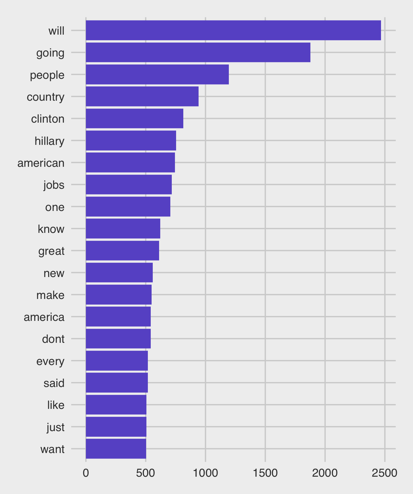
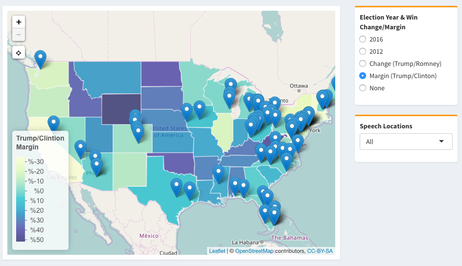

## Brainstorming ideas

We began after Spring Break, ready to go. We first wanted to do a project looking at cost of living across the US. As we were discussing it, it appeared to be too broad a task and we couldn't think of any way to incorporate text, which we were all interested in working with. So we decided to go back to the drawing board (literally). We then decided to start from thinking of which text was most interesting, rather than a topic and then trying to find text for it. Donald Trump's speeches instantly came to mind, given that he managed to win the Presidency based on the effectiveness of his message. We then thought about what we could do, as you can see in the image below:

We decided we defintely wanted to make a shiny app (having excitedly looked ahead at the syllabus..) and that an interactive map would be the key feature before a more detailed analysis below. What would be in the analysis however was yet to be decided.

## Getting the data

We got the data from a website (http://www.presidency.ucsb.edu/2016_election_speeches.php?candidate=45&campaign=2016TRUMP&doctype=5000), which contained a link to each of Donald Trump's election speeches. First we used Python to webscrape the .txt files (web_scraper.py, in our Github folder). Then we made a corpus and collected meta data for the states, which we found from FiveThirtyEight (https://github.com/fivethirtyeight/data/tree/master/hate-crimes). Once we had the data we were ready to begin exploring!

## EDA and initial plots

The first thing we did with our corpus was to look at the top words and make a bar chart to represent this.

This was somewhat interesting but did seem to show a lot of meaningless words. We then decided we wanted to focus our analysis on topics rather than single words, given the difficulty in extracting meaning from words.

We then worked on making dictionaries, using the most common themes Trump used to rouse support during his campaign, The Economy, Immigration (which we took to be separate as it tended to be more about social effects not just economic), Healthcare, ISIS and Washington, which we used to represent his attempts to present himself as anti-establishment. 

The first plot which came to mind when looking at the topics, was which topics were spoken about more or less in states where Trump increased his vote vs. Romney. Having previously made a word cloud to show this, we realized the benefits of our new approach, which made the differences far clearer:

## Layout of the UI

As we began to get some plots together which looked interesting and could be included in our final project, we worked on how we wanted our site to look. We quickly agreed we wanted the map to be the first thing the user sees, followed by an analysis of the change in topics over time and then subsequently a look into the different demographics of the states, to see if there were any relationships with particular topics. 

We started off with the map. The main features we wanted were that the chloropleth component would be interactive, so the user could switch between 2012 vote, 2016 vote, change and margin. We also wanted to display some other information about the speech which was given in the state. At first, our app used `ShinyDashboard`, and each item was in a box. Initially it looked like below:

We then started adding the plots below, one by one, until we has a full page of plots. 

## Finishing up/adding features

As the weeks rolled on, we had a series of plots in the website and it was beginning to resemble what we had hoped it would. We decided to add a CSS layer after the professor showed us how to do it during class, and then centered all of our text and removed the boxes to make the site look cleaner. We found a link on FiveThirtyEight which we liked (https://projects.fivethirtyeight.com/mortality-rates-united-states/violence/#2014), and we decided to model our format on theirs. 

We also added the cosine similarity and top words for each state to the map, so a user could simply click on one of the locations and the top words would be displayed. We realized we could also show these similar states on the map, so decided to include that feature.

We then went through our charts and made them look uniform in nature, this involved changing some from `ggplotly` to `plot.ly`, and maintaining the same colors throughout.

Finally we added some text, to tell our story. We think there is enough here to say that some of the content in Trump's speeches was targeted towards certain audiences, and that different topics did seem to have a different impact on the outcome of the vote. 

## Key Takeaways + Future Study

The key success for our project has been meeting regularly, from early on, and constantly discussing the theme and objective rather than a more fragmented approach. As can be seen in the plot below, as well as from our many commits to Github over the past month, we made the website in early April and have been regularly checking since. 

Of course, there is still so much more we could have done. Even as the project was almost complete, we decided to include polling data and link this to the topics. We think there is enough material here to do significant additional work to see the causal effect of different topic usage on local polling. 

## Conclusion

Overall it has been a great deal of hard work, but we have thoroughly enjoyed the challenge and are all proud of what we have produced. We hope you like it!
